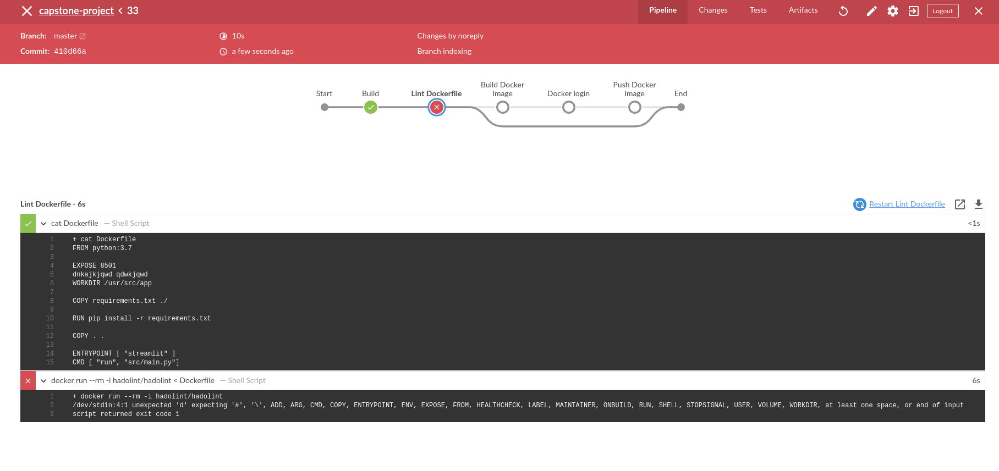

# capstone-project

### Thanks for all the community help and resources shared in the forums

The following resources I used to finish the capstone project

> https://docs.aws.amazon.com/eks/latest/userguide/getting-started-console.html

> https://medium.com/@andresaaap/capstone-cloud-devops-nanodegree-4493ab439d48

### And thanks for this student submission:

> https://medium.com/@sabbirhossain_70520/capstone-project-cloud-devops-udacity-25d0fd72833e

## DevOps

Steps in Completing Your Project

- Step 1: Propose and Scope the Project

  - The project deploys an app to the AWS Kubernetes Cluster 
  - Used Jenkins for the CICD pipeline
  - Deployment type Chosen: Rolling deployment
  - Used Docker Hub for pulling the images
  - Build a minimal streamlit app for Text processing

- Step 2: Use Jenkins, and implement blue/green or rolling deployment.
  - [x] Create your Jenkins master box with either Jenkins and install the plugins you will need.
  - [x] Set up your environment to which you will deploy code.
  
- Step 3: Pick AWS Kubernetes as a Service, or build your own Kubernetes cluster.
  - [x] Used CloudFormation to build the infrastructure
  - [x] The Kubernetes cluster initialization with Cloudformation

- Step 4: Build your pipeline
  - [x] Construct your pipeline in your GitHub repository.
  - [x] Set up all the steps that your pipeline will include.
  - [x] Configure a deployment pipeline.
  - [x] Include your Dockerfile/source code in the Git repository.
  - [x] Include with your Linting step both a failed Linting screenshot and a successful Linting screenshot to show the Linter working properly.
  
  
- Step 5: Test your pipeline
  - [x] Perform builds on your pipeline.
  - [x] Verify that your pipeline works as you designed it.
  - [x] Take a screenshot of the Jenkins pipeline showing deployment and a screenshot of your AWS EC2 page showing the newly modified (for rolling) instances.
  ### Before Rollout
  
  To rollout to a new commit the following cmd was used:
  
> `kubectl set image deployments/streamlit-app streamlit-app=gradjitta/streamlit-app:roll`

It results in the following CMD line outputs

  ### After Rollout
  
