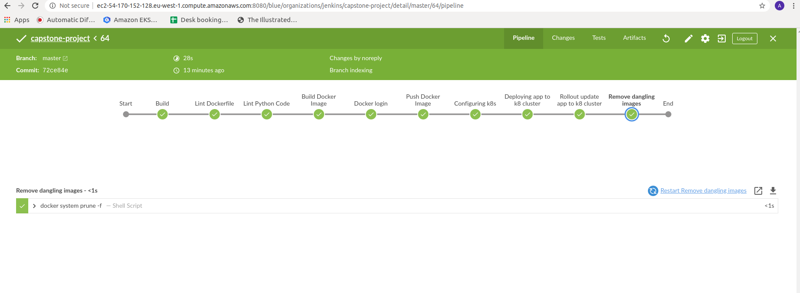

# Udacity DevOps Capstone Project

### Thanks for all the community help and resources shared in the forums

The following resources and Udacity resources were used to finish the capstone project

> https://docs.aws.amazon.com/eks/latest/userguide/getting-started-console.html

> https://medium.com/@andresaaap/capstone-cloud-devops-nanodegree-4493ab439d48

### And thanks for this student submission:

> https://medium.com/@sabbirhossain_70520/capstone-project-cloud-devops-udacity-25d0fd72833e

## DevOps

Steps taken in completing the Capstone project

- Step 1: Scope of the project

  - The project deploys an app to the AWS Kubernetes Cluster (done using `awscli` and `kubectl`)
  - Used Jenkins for the CICD pipeline 
  - Deployment type Chosen: Rolling deployment
  - Used **Docker Hub** for pulling the images
  - Built a minimal streamlit machine learning app for Text processing

- Step 2: Use Jenkins, and implement blue/green or rolling deployment.
  - [x] Create your Jenkins master box with either Jenkins and install the plugins you will need.
  - [x] Set up your environment to which you will deploy code.
  
- Step 3: Pick AWS Kubernetes as a Service, or build your own Kubernetes cluster.
  - [x] Used CloudFormation to build the infrastructure
        - Used 3 public subnets to deploy the nodes. All the CloudFormation files are present in the `aws-cf/` folder
  - [x] The Kubernetes cluster initialization with Cloudformation
  
  `./create.sh capstone-network-stack capstone-network.yaml capstone-network-params.json`
  
  `./create.sh capstone-cluster eks-cluster.yaml eks-cluster-params.json`
  
  `./create.sh capstone-eks-nodegroup eks-nodegroup.yaml eks-nodegroup-params.json`
  

- Step 4: Build your pipeline
  - [x] Construct your pipeline in your GitHub repository.
  - [x] Set up all the steps that your pipeline will include.
  - [x] Configure a deployment pipeline.
  - [x] Include your Dockerfile/source code in the Git repository.
  - [x] Include with your Linting step both a failed Linting screenshot and a successful Linting screenshot to show the Linter working properly.
  
  To test the linting step, the Dockerfile was ill-formated as shown:
  
  
  
  and it results in a filed pipeline in Jenkins as shown
  
  
   
   Once we remove the unwanted text from the Dockerfile we get
   
   
  
  
- Step 5: Test your pipeline
  - [x] Perform builds on your pipeline.
  - [x] Verify that your pipeline works as you designed it.
  - [x] Take a screenshot of the Jenkins pipeline showing deployment and a screenshot of your AWS EC2 page showing the newly modified (for rolling) instances.
  ### Before Rollout
  
  To rollout to a new commit the following cmd was used:
  
> `kubectl set image deployments/streamlit-app streamlit-app=gradjitta/streamlit-app:$IMAGE_TAG`

#### Rollout in action

It results in the following CMD line outputs

  ### After Rollout
  
